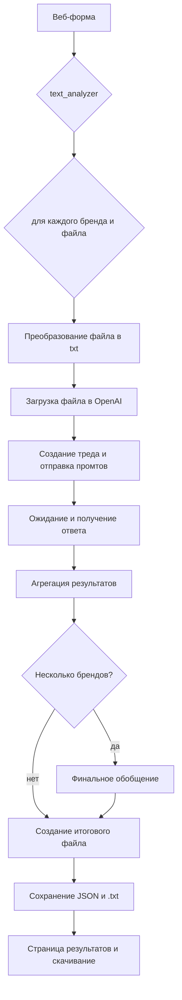

# TextAnalyzer

Ai tool for those who strive to automate analyzing the text
In this tool I did not use env. however it would be used in prod.

## Описание

Это веб‑сервис, который помогает маркетологам анализировать пользовательские комментарии о брендах. Пользователь загружает файлы с текстами, выбирает тип анализа (например, барьеры, драйверы, сегментация и т.п.), а система с помощью OpenAI‑моделей формирует сводки и сохраняет результаты в файл.

### Как работает шаг за шагом
1. **Ввод данных через веб‑форму.**  
   Пользователь указывает категорию, тип анализа, список брендов и загружает соответствующие файлы. После отправки формы данные передаются в функцию `text_analyzer`.

2. **Поочерёдный анализ каждого бренда и файла.**  
   `text_analyzer` проходит по парам “бренд–файл”: формирует специализированный промт в зависимости от выбранного типа анализа и вызывает функцию `analyze` (или `analyze_other_option`) для получения ответа от модели. Все полученные ответы собираются в общий текст и в JSON со структурированными результатами.


3. **Подготовка файла и отправка запроса в OpenAI.**
   Внутри `analyze` файл сначала преобразуется в `.txt`, при необходимости конвертируя из форматов Excel/CSV/PDF/DOCX. Формат `DOC` исключён, чтобы уменьшить размер зависимостей при деплое. Далее файл загружается в OpenAI, создаётся новый “тред”, куда отправляется стартовый промт и уточняющий промт с упоминанием конкретного бренда. После запуска треда функция опрашивает статус выполнения и забирает итоговый ответ модели.
=======
3. **Подготовка файла и отправка запроса в OpenAI.**  
   Внутри `analyze` файл сначала преобразуется в `.txt`, при необходимости конвертируя из форматов Excel/CSV/PDF/DOC(X). Далее файл загружается в OpenAI, создаётся новый “тред”, куда отправляется стартовый промт и уточняющий промт с упоминанием конкретного бренда. После запуска треда функция опрашивает статус выполнения и забирает итоговый ответ модели.


4. **Агрегация и итоговый отчёт.**  
   Когда все бренды обработаны, `text_analyzer` формирует текстовый файл с собранными результатами; если брендов больше одного, дополнительно запрашивается итоговое обобщение по всему набору. Файлы с результатами (JSON и финальный .txt) сохраняются в каталоге `output`, а имена файлов передаются в сессию для последующей выдачи пользователю.

5. **Отображение и скачивание результатов.**  
   Пользователь перенаправляется на страницу результатов, где может просмотреть сводку и скачать итоговый файл с анализа.


=======
```

## Деплой на Vercel
Чтобы разместить сервис на Vercel, укажите в настройках проекта папку `CommentRecogn` как корневую. Именно она содержит файл `UInt/app.py` и `requirements.txt` для установки зависимостей.
=======


### Схема работы (Mermaid)


## Деплой на Vercel
Чтобы разместить сервис на Vercel, укажите в настройках проекта папку `CommentRecogn` как корневую. Именно она содержит файл `UInt/app.py` и `requirements.txt` для установки зависимостей.

В репозитории добавлен файл `.vercelignore`, исключающий временные каталоги (`UInt/uploads`, `UInt/output` и др.), чтобы размер serverless‑функции не превышал лимит Vercel в 250 МБ.
=======
